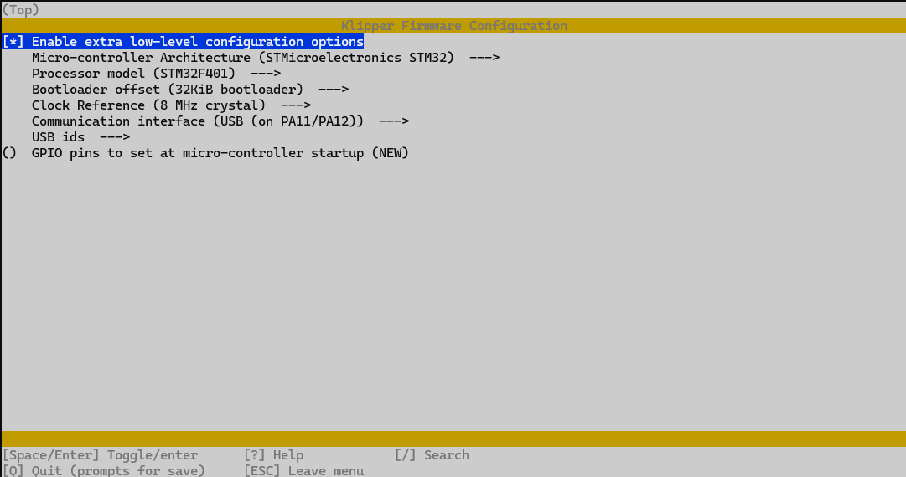
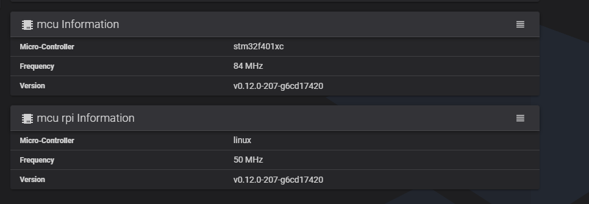

# Updating Infimech TX 3D Printer from Klipper 10 to Klipper 12

Guide/script still a work in progress but its good enough to upgrade to klipper 12. My end goal is to figure out what services are not needed(yes I think there are some) and remove the un-necessary clutter in the MKS user folder.

# Disclaimer
## **<span style="color:red">Preform this at your own risk, I am not responsible  if something happens while running this script. Making a backup is highly recommended.</span>**    

## What does this script do
- Runs through backing up config files and restoring them once klipper and moonraker is removed then reinstalled
- Saves current printer history including runtime
- You should not see a difference once this script is done running
- Webcamd and touch screen still work like normal
- Recompiles RPI mcu
- Fixes sources.list fist so that you can update(only to what is in the archive area) and apply security patches.
    - Future work to compile Armbian 24 and get this working corectly.... TBD

## What this script does not do
- Install script does not update the STM32 microcontroller to klipper 12 automatically, updating the microcontroller will be a manual process that is documented at the end of this [document](#manually-updating-microcontroller)

# Prerequisites
The following steps are for backing up and moving to a bigger eMMC module.
- Acquire an **eMMC to USB Adapter**: [MKS USB3 Adapter - AliExpress](https://www.aliexpress.com/item/1005005614719377.html) or [Adapter with spare eMMC - AliExpress](https://www.aliexpress.com/item/1005005998925775.html)  
 or  
 Acquire bigger **eMMC** [32GB version (without adapter)](https://kingroon.com/products/upgrade-32gb-eMMC-module-for-kingroon-kp3s-pro-v2-and-klp1?_pos=2&_sid=4770b8958&_ss=r) or [32GB version (without adapter) - AliExpress](https://www.aliexpress.us/item/1005006843564876.html).
- If using same eMMC card, backup all files in `/home/mks/klipper_config`
- Power off the printer and access the **Mainboard** by removing all the middle screws and loosening the outer ones.  
**DO NOT fully remove the outer screws as they are being held in with tnuts.**
- Remove the tow screws securing the eMMC module and safely lift it free

## Backing up eMMC Module (Highly recommended):
Windows (not tested)
- Use [usbimager](https://gitlab.com/bztsrc/usbimager) application, and follow their instructions. 

Linux
1. Insert eMMC module into USB module and insert into computer, make sure to insert it the correct way.
1. Run
    ```
    dd bs=4m if=/dev/sdX | gzip > infimechTx_bak.img.gz
    ```
1. Remove eMMC module from computer
1. Run the following if upgrading to bigger eMMC module
    - Replace eMMC module with larger eMMC module and insert into computer
    - Use [balena etcher](https://etcher.balena.io/) to flash to new eMMC if going to bigger drive
1. Remove from computer

## Installation:
1. Insert eMMC back into motherboard (wait till everything is working before putting the bottom back on)
1. Power on the printer
1. Access your printer's terminal console (via SSH or Serial)

### - SSH (Requires Ethernet Connection to a router/network switch)
- Determine the new IP of your printer (two options below):  
    a. Use your router's web interface > DHCP lease table.  
    b. Or use [**AngryIP**](https://angryip.org/download/) (`Settings Cog` > `Ports` > Clear `port selection` entries, type `7125`, `Ok`, then `Start`)
- Connect via SSH using: `ssh mks@YOUR-PRINTERS-IP`. Password: `makerbase`.

### - Serial (If ethernet access isn't available);
1) Connect your computer to the printer's USB-C port (`1500000 Baud` Serial terminal).   
  a. `Windows` users can use [**PuTTY**](https://www.chiark.greenend.org.uk/~sgtatham/putty/latest.html). Here is a useful quick connection [**Guide**](https://pbxbook.com/voip/sputty.html).  
  b. `Linux` users can use `screen` for terminal access (linux commands below).   
     ```
     lsusb
     ```
     Find the relevant ttyACM / ttyUSB device then paste yours into the command below.  
     ```
     screen /dev/tty* 1500000
     ```
     To exit screen, press `Ctrl + A` followed by `K`, then confirm with `Y`.  

2) Once connected login using: User: `mks`. Password: `makerbase`. 

# Download and run script
1. Pull script
    ```
     wget https://raw.githubusercontent.com/jimmyjon711/InfimechTxUpgrade/main/infimechTxUpgrade.sh && chmod +x ./infimechTxUpgrade.sh
    ```
1. Run script 
    ```
    ~/infimechTxUpgrade.sh
    ```
1. Either run all with `a` or choose each step in order from `1-8`
1. See sections with prompted with input
1. Once done reboot
    ```
    sudo reboot
    ```
1. Perform optional steps if everything is working

### - Updating armbian:
1. Choose `Y` to update `N` to continue without updates

### - Timezone Configuration:
1. Navigate to : `Personal` > `Timezone` to set your zone.
1. Exit

### -  Running Kiauh:
1. Hit `Y` to update and relaunch.
1. Choose `Y` if Kiauh updated
1. Enable automatic backups before updates (optional)
1. Type (`6`) for `Settings`
1. Type (`4`) for **<span style="color:green">Enable</span> automatic backups before updates**
1. Should now say - <span style="color:red">Disable</span> automatic backups before updates
1. Type (`b`) to navigate back
1. Time to remove and install all currently installed plugins  
    Removal
    1. Type (`3`) for `[Remove]`
        - Type (`1`) for `[Klipper]`
        - Type (`2`) for `[Moonraker]`
        - If you have any others installed (eg. mobileraker) note what you have installed and remove them now.  
            ( NOTE: You do not have to remove fluidd, have not tried mainsail )
        - Type (`b`) to navigate back

    Installation

    1. Type (`1`) for `[Install]`
    1. Type (`1`) for `[Klipper]` - install with python 3.x then follow on screen prompts
    1. Type (`2`) for `[Moonraker]` - follow on screen prompts
    1. If you removed anything else, add it back now
    1. Type (`b`) to navigate back
    1. Install G-Code Shell Command
        - Type (`4`) for `Advanced`
        - Type (`8`) for `[G-Code Shell Command]`
            - Select `Y` to install at your own risk
            - Select `N` to create and example shell command?
        - Type (`b`) to navigate back  

    Updating Other plugins

    1. Type(`2`) for `[Update]`
    1. Type(`4`) for `[Fluidd]`
       Manually update anything else
    1. Type(`b`) to navigate back
    1. Type(`q`) to quit kiauh  

### - Updating RPI mcu:  
Reference : https://www.klipper3d.org/RPi_microcontroller.html#install-the-rc-script  

1. In the menu, set "Microcontroller Architecture" to "Linux process," then save and exit.

### - Finished
1. Once all steps `1-8` are completed reboot and everything should be working correctly
1. If you run into the following error **Option 'position_endstop' is not valid in section 'stepper_z'** when rebooting, then navigate to your **printer.cfg** file and search for `[stepper_z]` then comment out the `position_endstop: -4` line. Save and restart.
1. Put bottom cover back on.
1. Rerun Temperature calibration, Resonance Compensation, and Auto leveling before using again
    ```
    PID_CALIBRATE HEATER=extruder TARGET=200
    ```
    ```
    PID_CALIBRATE HEATER=heater_bed TARGET=60
    ```

### - Optional Steps after everything is verified and working
- Remove configuration backup files with option `8`

##  - Enabling Webcam
- DO NOT USE CROWSNEST it does not work. Use webcamd instead
- Enable webcam with option `10` ( This can be ran at any time )
- In klipper web gui navigate to **Configuration**
- Open **webcam.txt** file and edit `camera_usb_options`. Make sure the `-d` option points to your webcam.
    - If you are having trouble finding your webcam run the following in an ssh session
        - Install **v4l-utils**  
        ```
        sudo apt get install v4l-utils
        ```
        - Download crowsnest helper tool and run 
        ```
        wget https://raw.githubusercontent.com/mainsail-crew/crowsnest/master/tools/dev-helper.sh && chmod +x ./dev-helper.sh && dev-helper.sh -c
        ```
        - Should look like the following  
        
        - Insert device for the `-d` option. In the screenshot the `-d` option would be `/dev/video4`


## Manually updating Microcontroller

The following instructions were provided by **GoldenGreek**

This process assumes that you have already run the InfimechTXUpgrade.sh file from this repository to get to klipper 0.12 first!  The directory structure that these steps assume are dependent on this.

1. SSH to the Infimech and login as mks/makerbase
1. `cd kiauh`
1. `./kiauh.sh`
1. If prompted to update, enter `Y`, and then rerun the above command to relaunch kiauh.
1. Select option (`4`) for `advanced`
1. Select option (`2`) for `build only`  
    
    You will get the Klipper Firmware Configuration window:
    
    

    Change the following settings:

    - Set Micro-Controller Architecture to STMicroelectronics STM32
    - Set Processor Model to STM32F401
    - Ensure that Bootloader offset is set to 32Kib bootloader
    - Ensure that communication interface is set to USB (on PA11/PA12)
    - Press `Q`, and `Yes` when prompted to save your configuration

    KIAUH will now compile your firmware:

1. Type `B` and hit enter to go back, then type `Q` and hit enter to quit KIAUH.
1. Enter the following command to rename and and copy the file so you can download it from fluidd:
    ```
    cp ~/klipper/out/klipper.bin ~/printer_data/config/mks_skipr_mini.bin
    ```
1. Go to your printer's web interface and download the mks_skipr_mini.bin file
1. Copy the file you downloaded to a microSD card.
1. Properly shutdown the Infimech and power it off then insert the microSD card into the sd-card slot.
    - This slot is located on the mainboard, and is accessible without taking the bottom off. There is an opening on the side that you can sneak the card in if you could see it properly. (But be careful, if you drop it then you are taking the bottom off to retrieve the sd-card)
    
        It's easiest to remove the left side panel to pop the card in.  The bottom does not need to come off.

1. Power on the printer, once you can get to the web interface navigate to `System` (second from the bottom option on the left side)
1. Verify `mcu information` Version shows **v0.12.0-xxx-xxxxxxxxx** (See picture below), your x's will be something different depending on when klipper was pulled from github.
    
1. Properly shutdown the Infimech and power it off then remove SD-Card from the MCU TF-Card slot.
